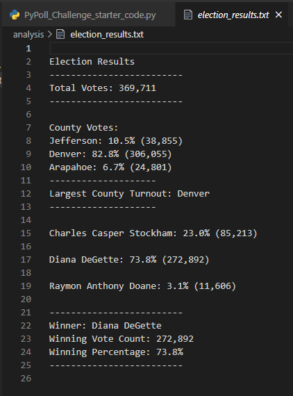
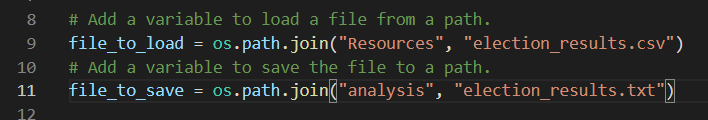
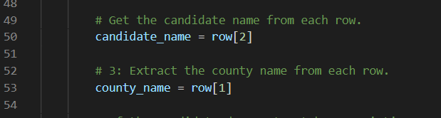

# **Election Analysis**

## **Overview of Election Audit**
The purpose of this audit was to analyze the total votes for the counties Denver, Jefferson, and Arapahoe to determine the winner of a local election. There was also analysis on the county that had the greatest voter turnout, which could be used in future campaigns and marketing strategies. 

## **Election-Audit Results**

Our analysis was able to produce the following text file: 

                                                                    

Here we can observe the following: 

    -There were 369,711 total votes for all the counties. 
    -Of the total votes per county:
        *Denver county submitted 82.8% of the votes
        *Arapahoe county submitted 6.7% of the votes
        *Jefferson county submitted 10.5% of the votes
    -The largest percentage of votes per county was Denver. 
    -Of the total votes per candidate: 
        *Charles Casper Stockham received 23.0% (85,213 total votes)
        *Diana DeGette received 73.8% (272,892 total votes)
        *Raymon Anthony Doane received 3.1% (11,606 total votes)
    -The winner of the election was Diana DeGette by a landslide percentage of 73.8% and total votes of 272,892. Her win was largely due to Denver county's turnout and voting pattern. 

## **Election-Audit Summary**
The code used to determine these results can be altered and recycled to use for future elections. Please observe the following: 

The "file_to_load" section connects to the .csv file used for analysis in this audit. For future audits, one can simply change the file name (the part that iterates the folder location and the file) to connect to the new election file.

We could also modify the script to display additional information, such as party affiliation. Observe the following code: 

Here we are finding the information in the .csv file based on column location. To add another observation, such as party affiliation, one would need an additional column in the .csv file that includes that information. We could then perform analysis after that and find things such as total number of voters for each party and percentage of voters in each party that voted for each candidate. 

